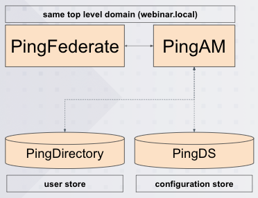

# Orchestration with PingFederate, PingAM and PingDirectory

This project is an example setup that leverages PingFederate, PingAM and PingDirectory to take advantage of the orchestration features that PingAM provides.

The target audiences for this setup are administrators and developers who want to understand more about this configuration and run it on-prem.

All products are configured via APIs call, no manual tasks are needed. This makes it very easy to get started and have the setup up and running after just a few minutes.

**Overview**

The environment of this setup looks like this:

Please read the document first before starting to set it up.

**Good to know**

- This setup was developed on a MacBook. If this is used on a Windows machine, the provided instructions may not work as expected
- Download links can be found at the bottom of this document

## Download products and integration kits

This webinar uses the following products and integration kits:

**Products:**

- PingFederate 12.1
- PingDirectory 10.1
- PingAM 7.5 (ForgeRock Intelligent Access 7.5)

**Integration Kits:**

- PingAM Integration Kit 1.0

Download those products, place them here: **./products/...** and follow the **README.md** instructions per product.

Licenses for PingFederate and PingDirectory should be requested at your CSM.

Download the integration kit:

- **https://www.pingidentity.com/en/resources/downloads/pingfederate.html**
- tab **Add-Ons**

Unzip the file and place the extracted jar-file at this location:

- **docker-build/add-ons/pingfederate/pf-pingam-adapter-1.0.jar**

## Prepare your environment

The setup uses these technologies throughout:

- Docker
- Make (this is just for convenience)
- Maven
- Java11

**Note:** further down are instructions on how to build this setup if Maven is not available!

### Update hosts file

To simulate a more realistic environment update the local hosts file:

- `sudo vi /etc/hosts`
  - add **{your-current-ip-address} pf.webinar.local pd.webinar.local openam.webinar.local playground.webinar.local**
    - replace **{your-current-ip-address}** with the current IP address of your computer. Do NOT use *localhost* or *127.0.0.1*
    - example: **192.168.0.12 pf.webinar.local pd.webinar.local openam.webinar.local playground.webinar.local**

### Install Frodo

In order to use example PingAM trees/ journeys install **Frodo-cli**:

- `brew tap rockcarver/frodo-cli`
- `brew install frodo-cli`

### Create initial configuration files and private/public keys

In the current directory, open a terminal and run these commands:

- `sh initialize-dev-environment.sh`
  - creates an **.env** file for docker and as input for **initialize-dev-tls-keypair.sh**
  - it also contains the configuration details for this setup
  - running this script again pushes the file to **dev/.env.bak**
  - the first time execution may display an error *mv: rename .env to dev/.env.bak: No such file or directory* which can be ignored
- `sh initialize-dev-tls-keypair.sh`
  - generates a keystore for this setup. Find generated files in **./dev**
  - the same keystore is used by PingFederate, PingAM and PingDirectory
  - the first time execution may display an error *mv: rename ./dev/tlskey.p12 to ./dev/tlskey.p12.bak: No such file or directory* which can be ignored

## Build the setup

### Review and potentially update the default configuration

All configuration details are taken out of **.env**. The settings in this file are used throughout all configuration steps further down.

For the purpose of this setup all values can most likely stay as they are.

The only exceptions are these:

- update the file to configure and register an oauth client in PingFederate
- update the file to use the journey **WebinarJourneySNS** which requires AWS SNS credentials

### Compile code and build docker images

**Option 1:** Java and Maven are available:

- `make build_all`
  - builds all java code and docker images. Open the file for more details if desired
  - run this command whenever the java code or the dockerfiles have been updated

**Option 2:** Maven is not available:

- `make build_builder`
  - this creates a docker image that contains Java and Maven
  - repeat this only if **pom.xml** changes or anything within **/libs**
- `make build_all_builder`
  - the same as **make build_all**, but it uses the builder image to compile the code

**Tip:** Wherever **make** is used, have a look into **Makefile** to learn more about the details of that task.

## Get the system up and running

These are the steps to launch and use the setup. Repeat these steps after stopping the setup.

All previous instructions are required once only and may be repeated if java code or the dockerfiles have been modified.

### Launch the setup

The whole setup is based on docker images and is launched using this command:

- `docker compose up`
  - view the file **docker-compose.yml** for browser admin URLs for the different products

### Configure the running setup

At this point PingFederate and PingAM are basically empty containers (PingDirectory already contains example users and is ready to go).

Configure the products:

- `make configure_setup`
  - imports LDIF files into PingDirectory
  - configures PingFederate and PingAM

Import example PingAM journeys:

- `frodo conn add -k https://openam.webinar.local:8449/openam amAdmin 'Password1'`
  - this adds a connection to frodo's configuration file which is stored here: **~/.frodo/Connections.json**
  - run this only the first time or after Frodo got updated

- `make import_journeys`
  - imports example journeys into PingAM

**Tip:** to learn how PingFederate and PingAM are configured, review the **main** method in **src/main/java/com/pingfederate/webinar/Main.java**

All imported journeys names start with **Webinar** and can be found here:

- https://openam.webinar.local:8449/openam
- realm **webinar**
  - Authentication
    - Trees

### Stopping containers

Once done with this setup stop it by running the following in the active terminal:

- `ctrl+c`
- `docker compose down`

## Try out a journey

In this setup PingAM is connected to PingDirectory which includes 10 test users.

The usernames and passwords follow this pattern:

- **user.1/ password**
- **user.2/ password**
- **...**

### Using an OAuth client

If you have configured an oauth client in **.env** open your client and select the **Login** button or whatever it may be that initiates an authorization_code flow.

PingFederate will redirect to PingAM where the user is taken through the configured journey.

After successful authentication the user gets redirected back to PingFederate and then back to the oauth client.

**Tip:** To install and use **OAuthPlayground** (which is a test/ demo OAuth client) follow these instructions:

- **docker-build/add-ons/oauthplayground/README.md**

### No OAuth client

Even without an oauth client it is possible to try out a journey. However, this does not use PingFederate.

Open a browser:

- **https://openam.webinar.local:8449/openam/XUI/?realm=/webinar&service=WebinarJourney#login**

Replace **...=WebinarJourney** with another journey. Find the name in **Makefile** or in the PingAM UI.

The successful journey ends with a view of the users profile.

### Reconfigure PingFederate to invoke a different Journey

**Note:** This update is only useful in combination with an oauth client

In PingFederate go to **Authentication - IDP Adapters - PingAMIdpAdapter** and review its configuration.

Replace **JOURNEY** with **WebinarJourneyOAthPush**.

The next time a user authenticates, the OAth Push journey will be executed:

- authenticate using username/ password
- register device
- confirm verification code
- signed in

**Note:** The user will be asked to download the ForgeRock Authenticator app for that.

## A few other notes

If you wonder what docker images have been built throughout this setup, run this command:

- `docker images | grep webinar`

If the build process fails, due to missing resources or space limitations, try these:

- `docker rmi $(docker images -f "dangling=true" -q)`
- `docker builder prune`

If you want to connect into a running image, use this:

- `docker exec -it {container_name} bash`
  - **{container_name}** -- see **docker-compose.yml**

To view log files in OpenAM:

- `docker exec -it openamwebinarlocal bash`  // the prompt is now within the running container
- `cd /forgerock/am_config/var/debug`
- `ls -la`  // several log files are listed

To view log files in PingFederate:

- `docker exec -it pfwebinarlocal bash`  // the prompt is now within the running container
- `cd /opt/pingfederate/log`
- `ls -la`  // several log files are listed

When done with the evaluation of this setup, it could be useful to remove the images as they are large in size:

- `docker rmi $(docker images --filter=reference="webinar/*" -q)`
  - any image tagged as **webinar/** will be deleted

## Links

- Download PingFederate:
  - [https://www.pingidentity.com/en/resources/downloads/pingfederate.html](https://www.pingidentity.com/en/resources/downloads/pingfederate.html)
  - the PingAM integration kit is already part of this setup, no need to download it separately
- Download PingAM:
  - [https://backstage.forgerock.com/downloads/browse/am/featured](https://backstage.forgerock.com/downloads/browse/am/featured)
- Download PingDirectory:
  - [https://www.pingidentity.com/en/resources/downloads/pingdirectory-downloads/previous-releases.html](https://www.pingidentity.com/en/resources/downloads/pingdirectory-downloads/previous-releases.html)
- PingFederate Swagger-UI:
  - [https://pf.webinar.local:9999/pf-admin-api/api-docs/#/](https://pf.webinar.local:9999/pf-admin-api/api-docs/#/)
- PingAM Swagger-UI:
  - [https://openam.webinar.local:8449/openam/ui-admin/#api/explorer/](https://openam.webinar.local:8449/openam/ui-admin/#api/explorer/)
- Frodo, a management tool for PingAM:
  - [https://github.com/rockcarver/frodo-cli?tab=readme-ov-file#quick-start](https://github.com/rockcarver/frodo-cli?tab=readme-ov-file#quick-start)
- Create a WebAuthN tree in PingAM
  - [https://backstage.forgerock.com/docs/am/7.4/authentication-guide/authn-mfa-webauthn.html](https://backstage.forgerock.com/docs/am/7.4/authentication-guide/authn-mfa-webauthn.html)
- Learn more about setting up a push notification service leveraging AWS SNS:
  - [https://backstage.forgerock.com/docs/am/7.4/authentication-guide/authn-mfa-trees-push.html](https://backstage.forgerock.com/docs/am/7.4/authentication-guide/authn-mfa-trees-push.html)
- Manage directory schemas with LDIF:
  - [https://backstage.forgerock.com/docs/am/7.4/install-guide/supported-ldifs.html](https://backstage.forgerock.com/docs/am/7.4/install-guide/supported-ldifs.html)
- PingIdentity on YouTube:
  - [@PingIdentityTV](https://www.youtube.com/@PingIdentityTV/videos)
- Webinar: This setup was used during a webinar and can be found here:
  - [https://www.pingidentity.com/en/company/upcoming-events/webinars/details/commId/620098.html](https://www.pingidentity.com/en/company/upcoming-events/webinars/details/commId/620098.html)

# DISCLAIMER

This is not a production environment and is meant for educational purposes only.

It does not come with any kind of warranty, it is provided as is, it was not reviewed for potential performance or security weaknesses.

Logs are verbose to provide insight into the configuration and may include secrets used during this demo.

Use this project to evaluate this setup. Modify it as much or as little as you like.

Report any issues here in GitHub, PingIdentities support team cannot provide assistance of any kind.

This code is to be used exclusively in connection with Ping Identity Corporation software or services. Ping Identity Corporation only offers such software or services to legal entities who have entered into a binding license agreement with Ping Identity Corporation.

# License

This is licensed under the Apache License 2.0.
